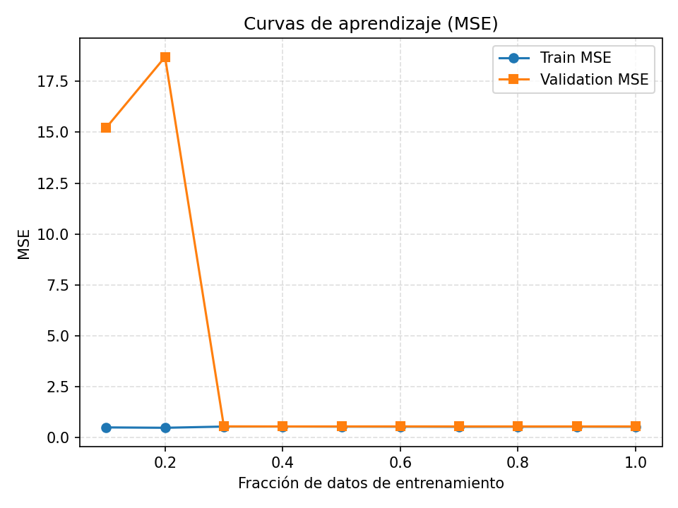
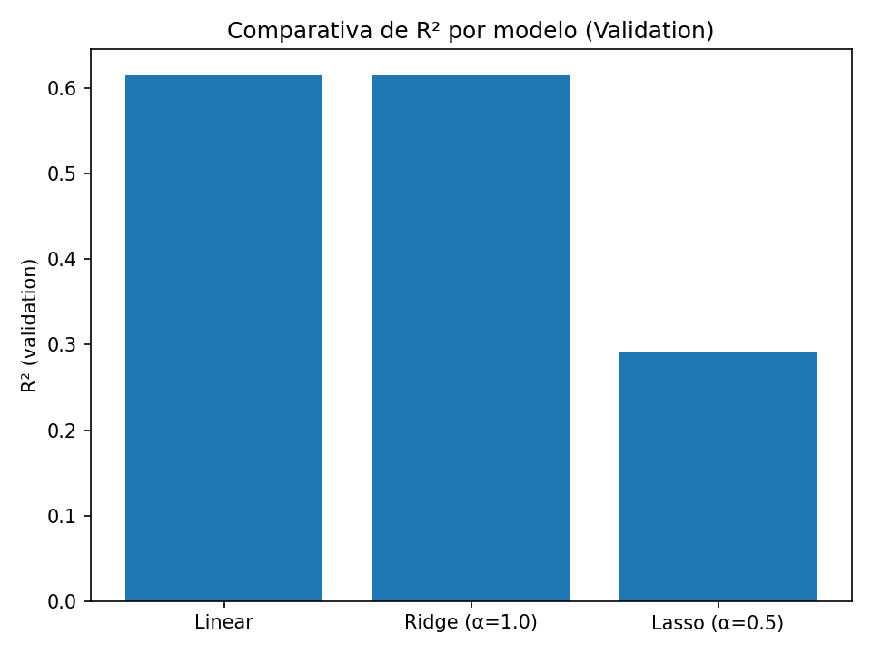
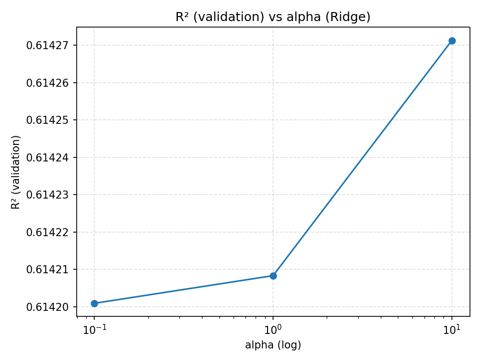
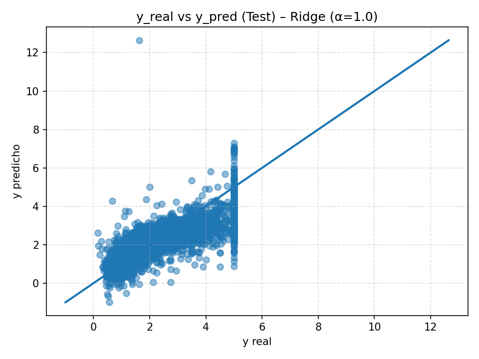

# Reporte de Análisis y Evaluación de Modelos de Regresión

## Introducción
El objetivo de este proyecto es implementar, evaluar y analizar modelos de regresión sobre el dataset California Housing, utilizando el framework scikit-learn.  
Se busca comparar diferentes enfoques de regresión (Linear Regression, Ridge y Lasso), medir su desempeño con métricas estandarizadas y diagnosticar el grado de sesgo, varianza y ajuste del modelo.  
Adicionalmente, se emplean técnicas de regularización (Ridge y Lasso) para mejorar el rendimiento y reducir problemas de sobreajuste o alta varianza.

---

## Metodología
1. **Dataset:** California Housing (8 features socioeconómicas + target: precio medio de la vivienda).  
2. **División de datos:**  
   - Train: 64%  
   - Validation: 16%  
   - Test: 20%  
3. **Preprocesamiento:**  
   - Estandarización de features para modelos con regularización (Ridge, Lasso).  
4. **Modelos probados:**  
   - `LinearRegression` (sin regularización).  
   - `Ridge (α=1.0)` con penalización L2.  
   - `Lasso (α=0.5)` con penalización L1.  
5. **Métricas:**  
   - Error cuadrático medio (MSE).  
   - Coeficiente de determinación (R²).  

---

## Resultados

### R² en validación
| Modelo             | R² (Validation) |
|--------------------|-----------------|
| Linear Regression  | 0.6142          |
| Ridge (α=1.0)      | 0.6142          |
| Lasso (α=0.5)      | 0.2924          |

El mejor modelo fue Ridge (α=1.0), con el mismo desempeño que Linear pero con menor riesgo de varianza excesiva debido a la regularización L2.

---

## Gráficas

### 1. Curvas de Aprendizaje
Muestra el comportamiento de MSE en train y validation conforme aumenta el tamaño de los datos de entrenamiento.  
Esto ayuda a diagnosticar sesgo y varianza.

---

### 2. Comparativa de Modelos
Comparación de R² en validación entre los tres modelos probados.

---

### 3. R² vs α (Ridge)
Evaluación del efecto de distintos valores de α en el desempeño del modelo Ridge.

---

### 4. y_real vs y_pred (Test)
Dispersión de valores reales contra predicciones en el conjunto de test para el mejor modelo.

---

## Diagnóstico

- **Sesgo (bias):** Bajo, el modelo logra capturar bien las relaciones del dataset (R² > 0.61).  
- **Varianza:** Media, el desempeño en test y validation es consistente, pero no perfecto. Ridge ayuda a mantener los coeficientes más estables.  
- **Nivel de ajuste:** Ajuste adecuado (good fit), no hay señales fuertes de underfitting (MSE bajo, R² aceptable), y la regularización evita overfitting.

---

## Regularización y Mejora
- **Linear vs Ridge:** Ambos tienen el mismo R² (0.6142), pero Ridge agrega estabilidad frente a colinealidad o ruido.  
- **Lasso:** Presenta peor desempeño (R²=0.2924), ya que elimina varios coeficientes, útil para feature selection pero no ideal en este dataset.  
- **Conclusión:** Ridge es preferible, ya que ofrece un balance entre sesgo y varianza sin perder capacidad predictiva.

---

## Conclusiones
- Se implementó y evaluó un modelo de regresión sobre el dataset California Housing.  
- La división Train/Validation/Test permitió analizar sesgo, varianza y nivel de ajuste.  
- El modelo Ridge (α=1.0) fue el mejor, manteniendo un R² de 0.6142 en validación y evitando riesgos de alta varianza.  
- El análisis muestra cómo la regularización es una herramienta clave para mejorar la generalización de los modelos de regresión.  
